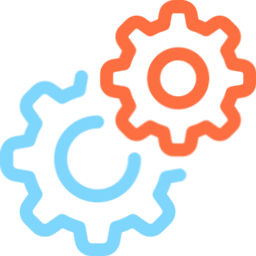

<div align="center">
  
  <h1>Lucas's Unity Assets</h1>
</div>

A personal collection of Unity tools and utilities that I build around my own project and learning needs. It reflects patterns and helpers that make my workflows smoother, so not every part will be useful for every project, but it keeps evolving as I try new ideas.


## Setup Guide

1. Open **Edit -> Project Settings -> Project Manager**
2. Under **Scoped Registries**, add the following:
```json
"scopedRegistries": [
    {
        "name": "package.openupm.com",
        "url": "https://package.openupm.com",
        "scopes": [
            "com.solidalloy",
            "com.openupm",
            "org.nuget",
            "com.dbrizov"
        ]
    }
],
```
3. Open **Window -> Package Manager**
4. Add https://github.com/lucaswarwick02/lucas-unity-assets.git as a Git URL


## Features

Below is a list of the different submodules:

- [Animation](Runtime/UnityAssets/Animation/README.md) (`AnimationLoop`, `AnimationGroup`)
- [Effects](Runtime/UnityAssets/Effects/README.md) (`Pulse`)
- [Enums](Runtime/UnityAssets/Enums/README.md) (`Direction2D`)
- [Extensions](Runtime/UnityAssets/Extensions/README.md)  (`Color`, `Enumerable`, `MonoBehaviour`, `Number`, `Object`, `Sprite`, `String`, `Transform`, `TypeReference`, `Vector`)
- [GameObjects](Runtime/UnityAssets/GameObjects/README.md) (`SmoothCameraFollow`, `UnityEventHook`)
- [Generic](Runtime/UnityAssets/Generic/README.md) (`Applicator<T>`, `Ref<T>`)
- [IO](Runtime/UnityAssets/IO/README.md) (`AbstractSaveData<T>`)
- [Maths](Runtime/UnityAssets/Maths/README.md) (`Curves`)
- [Pathfinding](Runtime/UnityAssets/Pathfinding/README.md) (`GridMovement`, `GridPathfinder`, `Node`)
- Shaders
- [Sound](Runtime/UnityAssets/Sound/README.md) (`SoundEffect`, `SoundEffectInstance`)
- [StateManagement](Runtime/UnityAssets/StateManagement/README.md) (`StateMachine`)
- [UI](Runtime/UnityAssets/UI/README.md) (`AbstractDeveloperConsole`, `DraggableUI`, `FloatingText`, `InteractiveButton`, `SceneTransition`, `WorldSpaceUI`)
  - [UI.Scrolling](Runtime/UnityAssets/UI/Scrolling/README.md) (`AutoScrollContent`, `HorizontalAutoScroll`, `VerticalAutoScroll`)